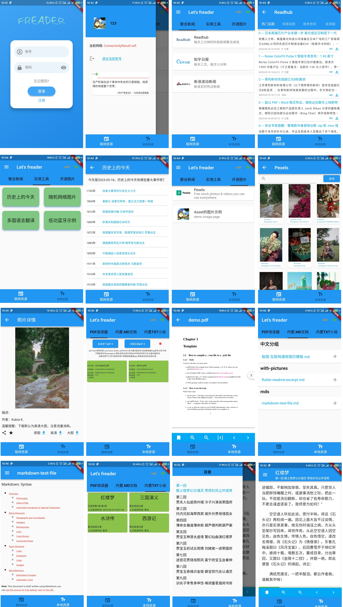

# freader

看一点在线新闻，读一些内置书籍。

使用 flutter 开发的，用于浏览部分聚合新闻，和阅读内置文档、书籍的 Android App。

## 功能说明

计划是分为`在线资源`和`本地资源`两个部分：

- 在线资源计划是可以聚合浏览各种来源的`聚合新闻`、一些大部分内容需要联网实现的`实用工具`、浏览或者下载一些`开源图片`；
- 本地资源计划是可以阅读本地的 pdf 文档、markdown 文档、txt 文档，但后两者显示处理比较麻烦，所以就只能看内置，pdf 可以从手机存储中选取；



## 很多问题

因为这是零基础情况下，一边看 flutter 官方教程一边看 flutter api 开发的第一个应用，属于新手试错阶段，可能存在低级错误。

- 使用 VBox 下 ubuntu18 虚拟机环境开发 + 小米 6 真机调试，只完成了 Android 部分，不具备普遍性，其他设备显示效果也可能不佳。
- 代码和功能本身也有很多问题，包括但不限于:
  - 很多异步请求未完成就直接返回其他页面时，未对其进行处理，所以可能会卡顿和报错；
  - 所有的新闻资源都只是获得 url 地址，使用 url_launcher 在 app 内部打开，显示效果不佳；
  - 有些有状态组件在 initState 中调用的资源可能没在 dispose 中释放；
  - 很多计划开发的功能模块都没有完成；`实用工具`中的翻译效果较差，布局也很怪；
  - 以及很多其他低级功能业务问题。
- 使用的在线资源都是在各种地方获取的 API，有些可能是开源的，也没有集中处理这些获取资源的模块。
  - 像百度翻译、pexels 的 API 授权 token，是我自己的，应该要自行替换。
- 没有自定义样式，更没有什么动画特效之类的，全是默认。
- 以及其他数不清的问题。

更多的问题，请不吝交流指导，谢谢。

## 项目结构

`/lib` 路径下:

```txt
│  main.dart    入口
├─common        一些工具类，如通用方法类、网络接口类、保存全局变量的静态类等
│  ├─config
│  └─utils      核心工具
├─layout        页面布局（一般上层页面）
├─models        json文件对应的Dart Model类会在此目录下，也包括一些state模型
├─utils         通用工具
├─views         页面
│  ├─image_view
│  ├─markdown_view
│  ├─news_view
│  ├─pdf_view
│  ├─tools_view
│  └─txt_view
└─widgets       APP内封装的一些Widget组件都在该目录下
```

注意 layout 中内容算是比较重要了。

app -> context_local -> news/tools/image  
app -> context_online -> pdf/markdown/txt

## 实现逻辑

- 联网的聚合新闻就是调用各种 API 获取到新闻包含 url 等数据的列表，然后使用 listview 展示，点击之后使用 url_launcher 内部跳转。
- 实用工具也是找到对应的 API 进行调用，把结果显示出来而已。
- 开源图片计划去 pexels 和 Unsplash 等网站注册调用开发者 API，将获取的图片用于展示和下载。
  - 下载目前直接保存文件在`/storage/emulated/0/Pictures/`路径下，不通用的。
- 内置的 pdf 和 txt 文件都会把相关数据存入内置的 sqlite 数据库中，除了第一次之外，后面都会从 db 中获取相关数据。
  - pdf 只有名称、路径、阅读进度等信息，txt 是把 txt 文件内容都存入了 db，然后按章节名称加载文字到内存处理。
  - txt 的展示不是很方便，所以实现比较基础，就是计算出某一章一共多少字，显示的字体大小，屏幕的大小，硬生生算出每页需要显示的内容。
    - 所以在放大/缩写字体后，会重新计算页数和每页显示数量，对应的阅读进度百分比应该是已阅读章节数/总章节数。
  - 虽然 markdown 文件和 txt 都是读取内置的 asset 文件，但后者需要安装严格的规范才能正确获取章节标题、内容等，前者就只是单纯使用插件展示而已。
- 登录页只是个展示页，用于路由跳转。第一次使用注册个帐号密码，后续登录成功就存入 SharedPreferences，下次启动 app 就不需登录了。
  - 其他诸如忘记密码之类的，更只是摆设，都是别人的组件。
