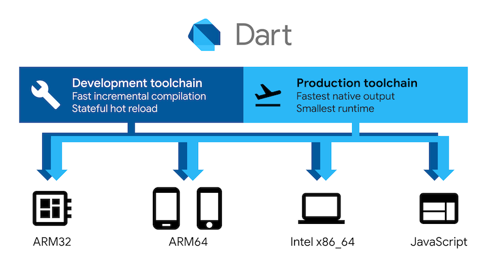

# 节选一部分 flutter 的 readme 文件内容

仅仅用于展示带本地图片的 markdown 写法的显示效果。

Flutter is Google's SDK for crafting beautiful, fast user experiences for
mobile, web, and desktop from a single codebase. Flutter works with existing
code, is used by developers and organizations around the world, and is free and
open source.

## About Flutter

We think Flutter will help you create beautiful, fast apps, with a productive,
extensible and open development model, whether you're targeting iOS or Android,
web, Windows, macOS, Linux or embedding it as the UI toolkit for a platform of
your choice.

### Beautiful user experiences

We want to enable designers to deliver their full creative vision without being
forced to water it down due to limitations of the underlying framework.
Flutter's [layered architecture] gives you control over every pixel on the
screen and its powerful compositing capabilities let you overlay and animate
graphics, video, text, and controls without limitation. Flutter includes a full
[set of widgets][widget catalog] that deliver pixel-perfect experiences whether
you're building for iOS ([Cupertino]) or other platforms ([Material]), along with
support for customizing or creating entirely new visual components.

### Fast results

Flutter is fast. It's powered by the same hardware-accelerated 2D graphics
library that underpins Chrome and Android: [Skia]. We architected Flutter to
support glitch-free, jank-free graphics at the native speed of your device.
Flutter code is powered by the world-class [Dart platform], which enables
compilation to 32-bit and 64-bit ARM machine code for iOS and Android, as well
as JavaScript for the web and Intel x64 for desktop devices.

<!-- 这个表示方式，本示例的组件不支持 -->
<!-- 

 -->

